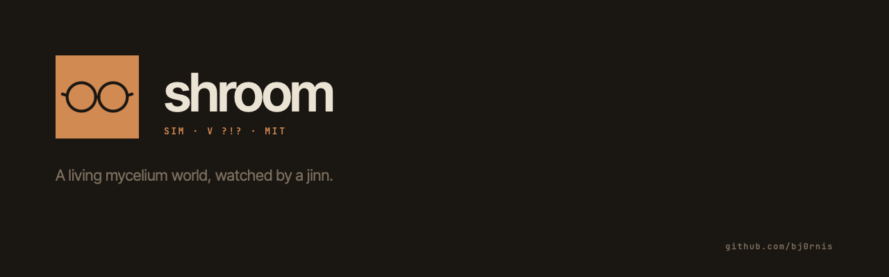

# shroom

A small living world runs here. Mycelium spreads through a fallen log.
Mushrooms fruit, release spores, and die. Seasons turn. Colonies are born with
a name and a genome, and the oldest ones are inscribed into a hall that persists
across volumes.

Nigehban — a jinn, old and unhurried — watches over the world and writes in the
journal. He calls a language model to do this. He does not always write. When
the world is quiet, he stays quiet too.

The simulation runs continuously on a server. One sim day is one real day.
Colonies live and die across weeks. Volumes close when a world-ending storm
(toofan) arrives. A new volume begins.

---

## What it is

A living pixel-art alife simulation, built to run persistently and be observed.
Not a game. Not a screensaver. Something closer to a terrarium that you can
check on.

- **Mycelium** grows cell by cell through soil and log substrate, branching
  when reserves allow.
- **Fruiting bodies** emerge when a colony is old and rich enough. Each one
  costs reserves. They mature, release spores, and decay.
- **Spores** drift on the breeze and germinate into new colonies — or don't.
- **Toofan** is the storm that ends a volume: fire, flood, frost, or wind.
  Colonies that fruited before it came are inscribed in the Hall of Fame.
- **Nigehban** observes all of it and writes in a journal, in English and Urdu.

---

## Stack

- **Backend** — Node.js + Express. No database. State is a JSON file, written
  atomically every ~200 ticks and on shutdown.
- **Frontend** — HTML5 canvas + React in the browser. No bundler. Babel
  transpiles JSX at runtime. Pixel-art design kit under `app/public/kit/`.
- **Canvas** — custom renderer, 320×180 upscaled 4× to 1280×720. Pixel-perfect.
- **LLM** — Nigehban calls `claude-haiku-4-5` via the Anthropic API. The sim
  keeps ticking if the call fails. He just stays silent.

---

## Running locally

```bash
cd app
npm install
MOCK=true npm run dev   # → http://localhost:3000
```

`MOCK=true` skips the Docker socket check. Nigehban needs an API key to write:

```bash
ANTHROPIC_API_KEY=sk-ant-… MOCK=true npm run dev
```

---

## Configuration

`ANTHROPIC_API_KEY` lives in `.env` beside `docker-compose.yml`.

| Variable | Default | Notes |
|---|---|---|
| `ANTHROPIC_API_KEY` | _(required)_ | Nigehban's voice. |
| `SHROOM_HOST` | `shroom.local` | Traefik `Host()` routing rule. |
| `NIGEHBAN_MODEL` | `claude-haiku-4-5` | Any Claude model ID. |
| `TICK_INTERVAL_MS` | `3000` | Real ms per sim tick. |
| `NIGEHBAN_INTERVAL_TICKS` | `600` | Periodic wake interval (~30 min real). |
| `NIGEHBAN_MIN_GAP_TICKS` | `200` | Hard floor between any two calls (~10 min). |
| `NIGEHBAN_DAILY_CAP` | `48` | Max calls per rolling 24h. |
| `MOCK` | unset | `true` for local dev. |
| `NIGEHBAN_DEBUG` | unset | `1` to log raw model responses. |

---

## Persistence

Data is bind-mounted at `/opt/home-server/data/shroom` on the host:

```
data/
├── current/
│   ├── world.json     full sim state (~600 KB)
│   └── journal.json   Nigehban's entries for the active volume
├── library/
│   └── vol-NNN.json   closed journals from past volumes
└── hall.json          inscribed colonies, persists across all volumes
```

---

## Pages

| URL | What it is |
|---|---|
| `/` | The world. Canvas + live colony leaderboard + journal. |
| `/engine` | Field guide to the simulation — how everything works. |
| `/preview` | Design kit workshop. Every component in isolation. |

---

## Debug endpoints

All `POST`, all return JSON.

| Endpoint | Effect |
|---|---|
| `/api/debug/sow` | Sow a random colony at a random log location. |
| `/api/debug/toofan?flavor=fire` | Trigger a storm. Flavors: flood / fire / frost / wind. |
| `/api/debug/nigehban-wake` | Force-wake Nigehban regardless of cooldown. |
| `/api/debug/inscribe` | Inscribe the top alive colony into the hall. |
| `/api/debug/save` | Force a world.json save now. |
| `/api/debug/reset` | Wipe and start a fresh volume 1. |

---

## Read-only endpoints

| Endpoint | Purpose |
|---|---|
| `/api/health` | Liveness. |
| `/api/world` | Meta + counts + top colonies + recent events. |
| `/api/world/snapshot` | Full grid, gzipped, for the canvas. |
| `/api/journal` | Nigehban's entries + usage state. |
| `/api/hall` | Hall of fame across all volumes. |
| `/api/engine-spec` | Live sim constants for the engine page. |

---

## Contributing

This is an open source project. The sim is the thing — changes that make the
world stranger, richer, or more alive are welcome. Changes that make it faster
to build on or easier to run are welcome. Changes that add complexity without
adding life are not.

Read `CLAUDE.md` before working on the code. Read `app/public/kit/KIT.md`
before working on the UI.
